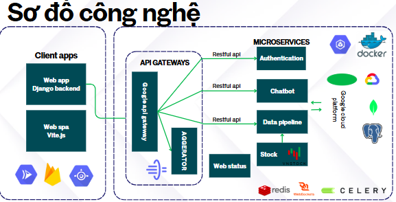

# EXcore AI: Nền tảng xây dựng báo cáo ESG và tư vấn phát triển dựa trên mục tiêu bền vững"
## Introduction



Sản phẩm này được dùng để tham gia cuộc thi Google Development Hackathon năm 2025, của nhóm Chúng tôi là những kẻ ngốc. Đây là sản phẩm MVP nên sẽ có những phần chưa hoàn thiện như trong Proposal, mong ban tổ chức và ban giám khảo có thể bỏ qua
## install
Sau đây là hướng dẫn chi tiết thực hiện và chạy dự án
### Clone repo into your space
```
git clone https://github.com/dinhtanloc/GDSC2025-ECOSCORE_AI.git
code GDSC2025-ECOSCORE_AI
```
### Frontend
```
cd frontend
npm i --legacy-per-deeps
```

### Backend
```
cd backend
pip install -r requirements.txt hoặc conda env update -f environment.yml --prune
# Ban tổ chức có thể thiết lập môi trường ảo nếu muốn

```

## quick start
You can start the application immediately by following these instructions.
Prepare the .env file for both the frontend and backend with the content as described below.
```
GDSC2025-ECOSCORE_AI/.env
#frontend
VITE_AG_CHART= key_AG_accounts
VITE_DOMAIN_BACKEND= http://127.0.0.1:8000
VITE_LANGSMITH= https://smith.langchain.com/o/02fd074a-1ef8-4483-8d12-ed3c37243258/projects/p/6a26e205-9955-4935-85fa-4a00127e892d?timeModel=%7B%22duration%22%3A%227d%22%7D
#backend
DJANGO_keys= django-keys

#chatbot
LANGCHAIN_API_KEY= < Your Langchain API key>
TAVILY_API_KEY= <Your Tavily API key>
OPEN_API_KEY = <Your open API key>
PATH_TO_GOOGLE_KEY = <File json chứa key của google development hackathon>
# Database
POSTGRESQL_DBMS_KEY= postgresql+psycopg2://postgres:<postgres username>@localhost/GDSC_2025
MONGODB_NAME = GDSC
MONGODB_URL= mongodb+srv://<mongodb atlas username>:<mongodb atlas password>@gdscdatabase.8mb9pqn.mongodb.net/?retryWrites=true&w=majority&appName=GDSCDatabase
DB_URL = postgres://postgres:<postgres username>@db:5432/GDSC_2025
DB_name=GDSC_2025
DB_user= <Your Postgre db username>
DB_password= <Your Postgre db password>
DB_port=5432

```
**Trường hợp ban tổ chức cần file .env của dự án, có thể liên hệ với nhóm Chúng tôi là những kẻ ngốc**


In the terminal, navigate to the root directory of the project and enter the following commands.

```
cd frontend

// ./frontend
npm run dev


// Your web backend domain is http://localhost:5173
cd backend

// ./backend
python manage.py migrate
python manage.py makemigrations
python manage.py migrate
python manage.py runserver //start backend

// Your web backend domain is http://localhost:8000
// If you want to create admin account to login Django backend admin template, you can use these syntax:
python manage.py makemigrations
// Input your infomation and follow instrucstion
// After you create admin accounts, you can login at http://localhost:8000/admin
```

## Report
You can see all information and report here [Report drive](https://drive.google.com/drive/folders/1grdqHzFVNXND2bPqbYF-Ff7zN9umYv5q?usp=drive_link)

## Reference
1. [Loc Dinh CarRetail Web](https://github.com/dinhtanloc/hw_web_development/tree/main)
2. [Loc Dinh AI Project](https://github.com/dinhtanloc/AI_project_final.git)
3. [Langchain document](https://www.langchain.com/)
4. [Langchain repository](https://github.com/langchain-ai/langchain)
5. [Rest API for Django](https://github.com/encode/django-rest-framework)
6. [MVP AI project](https://github.com/dinhtanloc/Stock-forecast-app-streamlit)